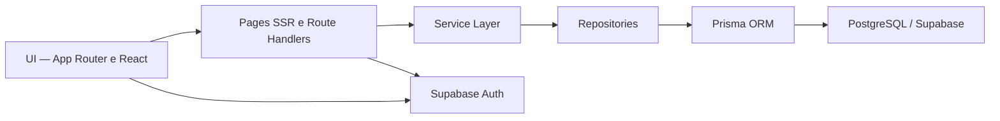

# Energy Monitor

Aplicação full stack para estimar, acompanhar e compreender o consumo energético residencial com histórico persistente e isolamento por usuário.


**[Acessar a aplicação](https://energy-monitor-black.vercel.app)** · **[Ver o repositório](https://github.com/Belchi0r/energy-monitor)**

## Visão geral

O Energy Monitor centraliza o cadastro de dispositivos residenciais, estima consumo e custos e transforma esses dados em indicadores, gráficos, alertas e recomendações práticas. O projeto explora uma arquitetura full stack com renderização no servidor, APIs REST, persistência relacional e autenticação por usuário.

As estimativas são calculadas a partir da potência, do tempo médio de uso e do perfil de utilização dos dispositivos cadastrados. A versão atual não recebe dados de sensores, não realiza telemetria em tempo real e não utiliza IA ou machine learning.

## Demonstração

### Dashboard

<!-- Adicionar screenshot profissional da dashboard. -->

_Espaço reservado para uma captura da visão geral de consumo._

### Dispositivos

<!-- Adicionar screenshot profissional da gestão de dispositivos. -->

_Espaço reservado para uma captura do cadastro e dos perfis de uso._

### Histórico

<!-- Adicionar screenshot profissional do histórico. -->

_Espaço reservado para uma captura das análises e comparações entre períodos._

## Principais funcionalidades

- Cadastro, autenticação, confirmação de e-mail e recuperação de senha.
- Dashboard com estimativas de consumo em kWh e custo em reais.
- Cadastro, edição e remoção de dispositivos com perfis de utilização.
- Tarifa personalizada, persistida por usuário e sincronizada entre dispositivos.
- Análises de hoje, 7 dias e 30 dias, com comparações quando há histórico suficiente.
- Histórico incremental com snapshots diários da residência e de cada dispositivo.
- Gráficos, distribuição de consumo, timeline de atividades e indicadores por período.
- Alertas e recomendações determinísticas baseados em regras de consumo.
- APIs REST com validação de entradas e parâmetros por Zod.
- Interface responsiva e demonstração pública somente leitura, isolada dos dados privados.

## Arquitetura

As páginas renderizadas no servidor e os Route Handlers reutilizam regras de negócio concentradas na camada de serviços. O acesso a dados passa por contratos de repositório, mantendo a persistência desacoplada da interface e das APIs.



A demonstração pública utiliza uma fonte de dados simulada e isolada, sem consultar dispositivos ou histórico de usuários autenticados.

## Persistência histórica

O histórico é construído incrementalmente em duas entidades principais:

- `DailyEnergySnapshot`: consolida consumo, custo, quantidade de dispositivos ativos e tarifa de um usuário em uma data.
- `DailyDeviceEnergySnapshot`: preserva a participação estimada e o nome de cada dispositivo naquele snapshot.

Cada usuário possui no máximo um snapshot por dia. Registros anteriores permanecem congelados, dias sem captura continuam ausentes e não são preenchidos artificialmente com zero. Comparações entre períodos só são disponibilizadas quando a cobertura necessária existe nos dados persistidos.

## Cálculo energético

O consumo diário estimado de cada dispositivo parte da fórmula:

```text
consumo (kWh) = potência (W) / 1000 × horas médias de uso por dia
custo estimado = consumo (kWh) × tarifa (R$/kWh)
```

Os perfis de utilização distribuem essa estimativa ao longo do dia para compor gráficos, picos e análises temporais. As recomendações são geradas por regras determinísticas sobre esses resultados.

> O Energy Monitor trabalha atualmente com estimativas baseadas nos dispositivos cadastrados. Não existe medição física em tempo real nesta versão.

## Tecnologias

| Área | Tecnologias |
| --- | --- |
| Frontend | Next.js 16, React 19, TypeScript, Tailwind CSS, Motion, Recharts |
| Backend | Next.js App Router, Server Actions, Route Handlers, APIs REST |
| Banco de dados | PostgreSQL, Supabase, Prisma ORM |
| Autenticação | Supabase Auth, `@supabase/ssr` |
| Validação | Zod |
| Testes e qualidade | Vitest, ESLint, TypeScript strict |
| Versionamento | Git, GitHub |
| Deploy | Vercel |

## Testes e qualidade

A validação final do projeto inclui:

- 49 arquivos de teste e 556 testes aprovados.
- ESLint sem erros.
- verificação de tipos com TypeScript strict.
- build de produção concluído.
- aplicação publicada e funcional na Vercel.

Comandos utilizados no fluxo de validação:

```bash
npm test
npm run lint
npx tsc --noEmit --incremental false
npm run build
```

## Segurança

- Autenticação e sessão SSR gerenciadas pelo Supabase Auth.
- Rotas e APIs privadas exigem um usuário autenticado.
- Consultas e operações de dispositivos são sempre filtradas pelo identificador do usuário.
- Row Level Security habilitada para dispositivos e tabelas de histórico, com políticas de acesso aos próprios snapshots.
- Cookies de sessão protegidos no fluxo SSR e prova temporária assinada para recuperação de senha.
- Validação de payloads e parâmetros com Zod.
- Demo pública somente leitura com fronteira explícita para não acessar dados privados.

## Executando localmente

### Pré-requisitos

- Node.js e npm.
- Um projeto Supabase com PostgreSQL e Auth configurados.

### Instalação

```bash
git clone https://github.com/Belchi0r/energy-monitor.git
cd energy-monitor
npm ci
```

Crie um arquivo `.env` local. Os arquivos de ambiente já são ignorados pelo Git.

```dotenv
DATABASE_URL="postgresql://<usuario>:<senha>@<host>:<porta>/<banco>"
DIRECT_URL="postgresql://<usuario>:<senha>@<host>:<porta>/<banco>"

NEXT_PUBLIC_SUPABASE_URL="https://<project-ref>.supabase.co"
NEXT_PUBLIC_SUPABASE_PUBLISHABLE_KEY="<chave-publicavel>"
NEXT_PUBLIC_SITE_URL="http://localhost:3000"

AUTH_RECOVERY_PROOF_SECRET="<segredo-com-pelo-menos-32-bytes>"
AUTH_PUBLIC_SIGNUP_ENABLED="true"
AUTH_EMAIL_OTP_ENABLED="false"
```

No Supabase Auth, adicione `http://localhost:3000/auth/confirm` e `http://localhost:3000/auth/callback` à lista de URLs de redirecionamento permitidas. Em seguida, aplique as migrations existentes e inicie o servidor:

```bash
npx prisma migrate deploy
npm run dev
```

A aplicação ficará disponível em [http://localhost:3000](http://localhost:3000), e a demonstração pública em [http://localhost:3000/demo](http://localhost:3000/demo).

## Estrutura do projeto

```text
app/          páginas, Server Actions e Route Handlers
components/   autenticação, dashboard, layout e componentes de UI
lib/          regras de domínio, serviços, repositórios, schemas e integrações
prisma/       schema, migrations e seed
tests/        testes unitários e de integração
public/       arquivos estáticos
```

## Roadmap

Possibilidades para versões futuras:

- integração com sensores físicos e dispositivos IoT;
- leitura automatizada de medidores de energia;
- exportação de relatórios em CSV e PDF;
- dashboards e recortes analíticos adicionais.

## Autor

**Luan Belchior**

Engenharia e desenvolvimento Full Stack

[GitHub](https://github.com/Belchi0r) · [LinkedIn](https://www.linkedin.com/in/luan-belchior-dev/)
