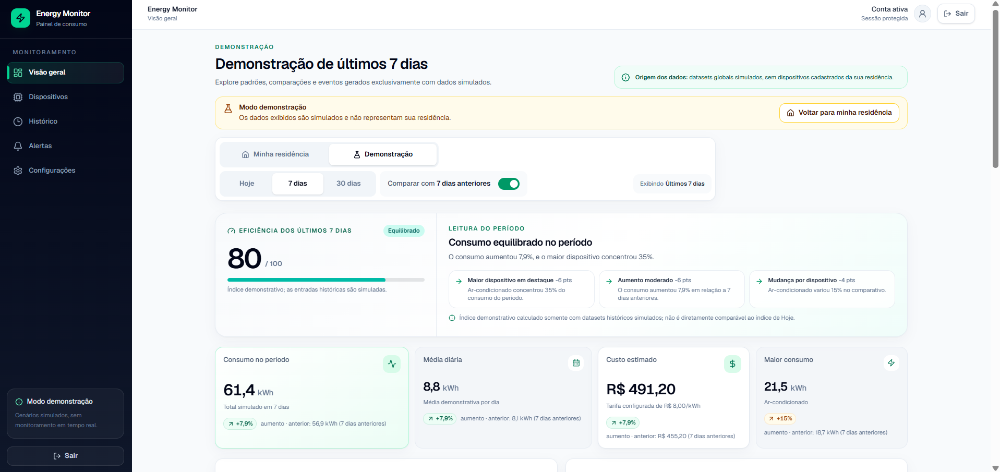
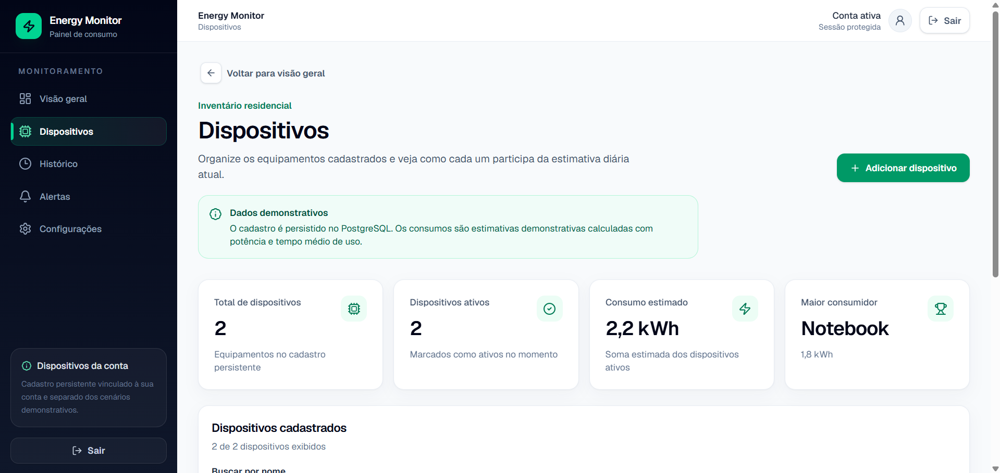
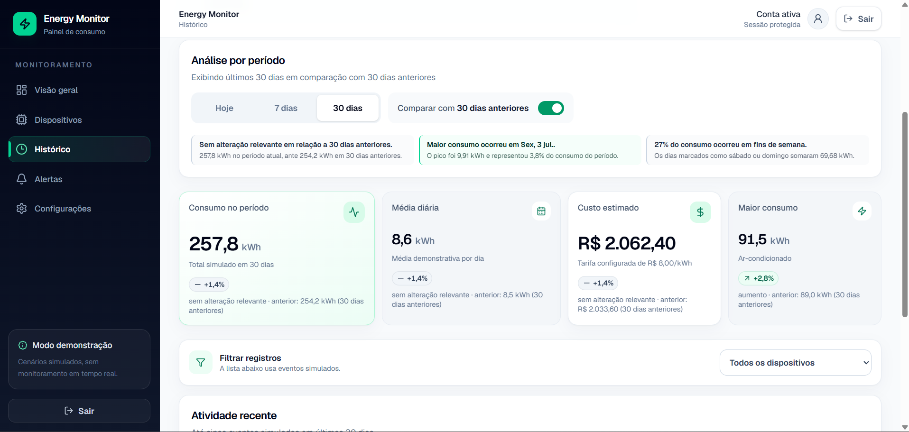
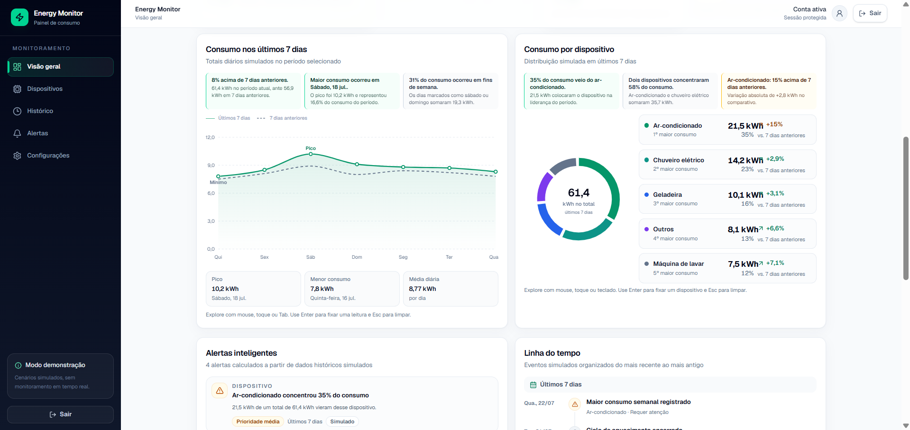
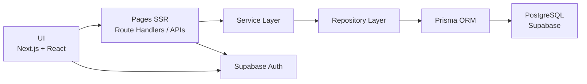

# Energy Monitor

Aplicação full stack para **estimativa, acompanhamento e análise de consumo energético residencial**, com autenticação, persistência histórica, isolamento por usuário e visualização de dados.


**[Acessar aplicação](https://energy-monitor-black.vercel.app)** · **[Explorar demonstração](https://energy-monitor-black.vercel.app/demo)** · **[Repositório](https://github.com/Belchi0r/energy-monitor)**

---

## Visão geral

O **Energy Monitor** foi desenvolvido para transformar informações de uso de equipamentos residenciais em uma visão clara de consumo, custos e comportamento energético.

A aplicação permite cadastrar dispositivos, configurar seus perfis de utilização e acompanhar estimativas por meio de dashboards, comparações entre períodos, histórico persistente, alertas e recomendações.

Além da interface, o projeto explora conceitos de engenharia de software como:

- autenticação e sessões SSR;
- arquitetura em camadas;
- Repository Pattern;
- Service Layer;
- APIs REST;
- persistência relacional;
- validação de dados;
- isolamento de dados por usuário;
- histórico incremental;
- testes automatizados;
- deploy em produção.

> [!NOTE]
> O Energy Monitor atualmente trabalha com **estimativas calculadas a partir dos dispositivos cadastrados, potência e perfil de utilização**.  
> Esta versão não utiliza sensores físicos, telemetria em tempo real, inteligência artificial ou machine learning.

---

## Demonstração

### Dashboard

Visão consolidada do consumo energético, custos estimados, eficiência, comparação entre períodos e principais indicadores da residência.



### Dispositivos

Gerenciamento dos equipamentos vinculados à conta, com persistência dos registros e estimativa individual de consumo.



### Histórico

Análise do comportamento energético por período, comparação com períodos anteriores e acompanhamento da evolução do consumo.



### Análise de consumo

Visualização temporal do consumo, distribuição por dispositivo, ranking, alertas e eventos relevantes.



---

## Principais funcionalidades

### Autenticação

- criação de conta;
- login e logout;
- confirmação de e-mail;
- recuperação de senha;
- gerenciamento de sessão com Supabase Auth;
- proteção de páginas e operações privadas.

### Monitoramento energético

- dashboard com estimativa de consumo em kWh;
- cálculo de custo energético em reais;
- tarifa personalizada por usuário;
- sincronização da tarifa entre diferentes dispositivos;
- análise de **Hoje**, **7 dias** e **30 dias**;
- comparação com períodos anteriores quando existe histórico suficiente.

### Dispositivos

- cadastro de equipamentos;
- edição;
- remoção;
- ativação e configuração de perfil de uso;
- cálculo individual de consumo;
- identificação dos dispositivos com maior impacto energético.

### Histórico

- snapshots diários por usuário;
- snapshots individuais por dispositivo;
- histórico incremental;
- preservação dos dados anteriores;
- comparação entre períodos baseada somente nos registros realmente disponíveis.

### Análises

- evolução temporal do consumo;
- distribuição por dispositivo;
- ranking de consumo;
- identificação de picos;
- indicadores de eficiência;
- alertas energéticos;
- recomendações determinísticas;
- timeline de eventos.

### Demonstração pública

A rota `/demo` disponibiliza uma versão somente leitura da aplicação utilizando dados simulados.

Essa demonstração é isolada dos dispositivos, histórico e informações privadas dos usuários autenticados.

---

## Arquitetura

O projeto utiliza uma arquitetura em camadas para separar interface, regras de negócio e persistência.



### Fluxo principal

```text
Interface
   ↓
Pages / Route Handlers
   ↓
Services
   ↓
Repositories
   ↓
Prisma ORM
   ↓
PostgreSQL
```

Essa separação reduz o acoplamento entre interface e banco de dados e permite concentrar as regras de negócio em camadas específicas.

---

## Persistência histórica

O histórico energético é construído de forma incremental.

Duas entidades principais armazenam os dados:

### `DailyEnergySnapshot`

Representa o estado consolidado de consumo de um usuário em determinada data.

Armazena informações como:

- consumo total;
- custo estimado;
- quantidade de dispositivos ativos;
- tarifa utilizada naquele dia.

### `DailyDeviceEnergySnapshot`

Preserva a participação dos dispositivos dentro de cada snapshot diário.

Isso permite manter informações históricas mesmo que os dispositivos sejam posteriormente alterados.

### Comportamento do histórico

- cada usuário possui no máximo um snapshot por dia;
- o snapshot atual pode ser atualizado durante o mesmo dia;
- snapshots de dias anteriores permanecem preservados;
- dias sem registro permanecem ausentes;
- dias inexistentes não são preenchidos artificialmente com zero;
- comparações são exibidas apenas quando existe cobertura histórica suficiente.

Essa abordagem evita apresentar dados que nunca foram realmente registrados pelo sistema.

---

## Cálculo energético

A estimativa diária de cada equipamento utiliza sua potência e tempo médio de utilização.

```text
consumo (kWh)
=
potência (W) / 1000
×
horas médias de uso por dia
```

O custo é calculado utilizando a tarifa configurada pelo usuário:

```text
custo estimado
=
consumo (kWh)
×
tarifa (R$/kWh)
```

Os perfis de utilização distribuem essas estimativas ao longo do dia para compor gráficos, análises temporais e identificação de picos.

As recomendações e alertas são baseados em **regras determinísticas de domínio**, e não em modelos de inteligência artificial.

---

## Stack

| Área | Tecnologias |
|---|---|
| **Frontend** | Next.js 16, React 19, TypeScript, Tailwind CSS, Motion, Recharts |
| **Backend** | Next.js App Router, Server Actions, Route Handlers, APIs REST |
| **Banco de dados** | PostgreSQL, Supabase |
| **ORM** | Prisma |
| **Autenticação** | Supabase Auth, `@supabase/ssr` |
| **Validação** | Zod |
| **Testes** | Vitest |
| **Qualidade** | ESLint, TypeScript strict |
| **Versionamento** | Git, GitHub |
| **Deploy** | Vercel |

---

## Decisões de engenharia

Alguns pontos do projeto foram tratados além da camada visual.

### Persistência da tarifa

A tarifa energética pertence ao usuário e é persistida no backend, permitindo que o mesmo valor seja recuperado após novo login ou acesso em outro dispositivo.

### Histórico sem fabricação de dados

O sistema não cria registros artificiais para dias nos quais não existe histórico.

Isso significa que uma comparação só é apresentada quando os dados necessários realmente existem.

### Separação de domínio e persistência

Regras de negócio ficam concentradas em services enquanto repositories abstraem o acesso ao banco de dados.

### Demo isolada

A demonstração pública utiliza datasets simulados e não acessa dados privados ou históricos pertencentes a usuários autenticados.

### Histórico imutável de períodos anteriores

Dados de dias anteriores são preservados, evitando que alterações atuais reescrevam artificialmente o passado.

---

## Testes e qualidade

A versão atual foi validada com:

- **49 arquivos de teste aprovados**;
- **556 testes aprovados**;
- ESLint sem erros;
- verificação de tipos com TypeScript strict;
- build de produção concluído com sucesso;
- deploy funcional na Vercel.

Fluxo utilizado na validação:

```bash
npm test
npm run lint
npx tsc --noEmit --incremental false
npm run build
```

---

## Segurança

O projeto utiliza diferentes mecanismos para proteger dados e operações privadas:

- autenticação utilizando Supabase Auth;
- sessões integradas ao fluxo SSR;
- páginas e APIs privadas condicionadas à autenticação;
- operações de dispositivos filtradas pelo identificador do usuário autenticado;
- Row Level Security nas tabelas de histórico;
- políticas de acesso aos snapshots pertencentes ao próprio usuário;
- validação de payloads e parâmetros com Zod;
- demonstração pública isolada dos dados privados.

A arquitetura evita utilizar a interface como única camada de controle de acesso.

---

## Executando localmente

### Pré-requisitos

- Node.js;
- npm;
- projeto Supabase;
- PostgreSQL configurado.

### 1. Clone o repositório

```bash
git clone https://github.com/Belchi0r/energy-monitor.git
cd energy-monitor
```

### 2. Instale as dependências

```bash
npm ci
```

### 3. Configure as variáveis de ambiente

Crie um arquivo `.env` ou `.env.local`.

```dotenv
DATABASE_URL="postgresql://<usuario>:<senha>@<host>:<porta>/<banco>"
DIRECT_URL="postgresql://<usuario>:<senha>@<host>:<porta>/<banco>"

NEXT_PUBLIC_SUPABASE_URL="https://<project-ref>.supabase.co"
NEXT_PUBLIC_SUPABASE_PUBLISHABLE_KEY="<chave-publicavel>"

NEXT_PUBLIC_SITE_URL="http://localhost:3000"

AUTH_RECOVERY_PROOF_SECRET="<segredo-local-seguro>"
AUTH_PUBLIC_SIGNUP_ENABLED="true"
AUTH_EMAIL_OTP_ENABLED="false"
```

Nunca versione credenciais reais.

### 4. Configure os redirects no Supabase Auth

Adicione:

```text
http://localhost:3000/auth/confirm
http://localhost:3000/auth/callback
```

### 5. Aplique as migrations

```bash
npx prisma migrate deploy
```

### 6. Inicie o projeto

```bash
npm run dev
```

Aplicação:

```text
http://localhost:3000
```

Demonstração pública:

```text
http://localhost:3000/demo
```

---

## Estrutura do projeto

```text
energy-monitor/
│
├── app/
│   ├── api/
│   ├── auth/
│   ├── devices/
│   ├── history/
│   ├── settings/
│   └── ...
│
├── components/
│   ├── auth/
│   ├── dashboard/
│   └── ...
│
├── lib/
│   ├── repositories/
│   ├── services/
│   ├── energy/
│   └── ...
│
├── prisma/
│   ├── migrations/
│   └── schema.prisma
│
├── public/
│   └── screenshots/
│
└── tests/
    ├── integration/
    └── unit/
```

---

## Roadmap

Possibilidades para versões futuras:

- integração com sensores físicos;
- comunicação com dispositivos IoT;
- leitura automatizada de medidores;
- ingestão de dados energéticos reais;
- exportação de relatórios em CSV;
- geração de relatórios em PDF;
- novos dashboards e recortes analíticos.

Esses itens representam evolução futura e **não fazem parte da versão atual**.

---

## Autor

### Luan Belchior

Estudante de Engenharia na Universidade de Brasília (UnB) com foco em desenvolvimento Full Stack, software e tecnologia.

[GitHub](https://github.com/Belchi0r) · [LinkedIn](https://www.linkedin.com/in/luan-belchior-dev/)

---

<p align="center">
  Desenvolvido como projeto de engenharia de software e desenvolvimento Full Stack.
</p>